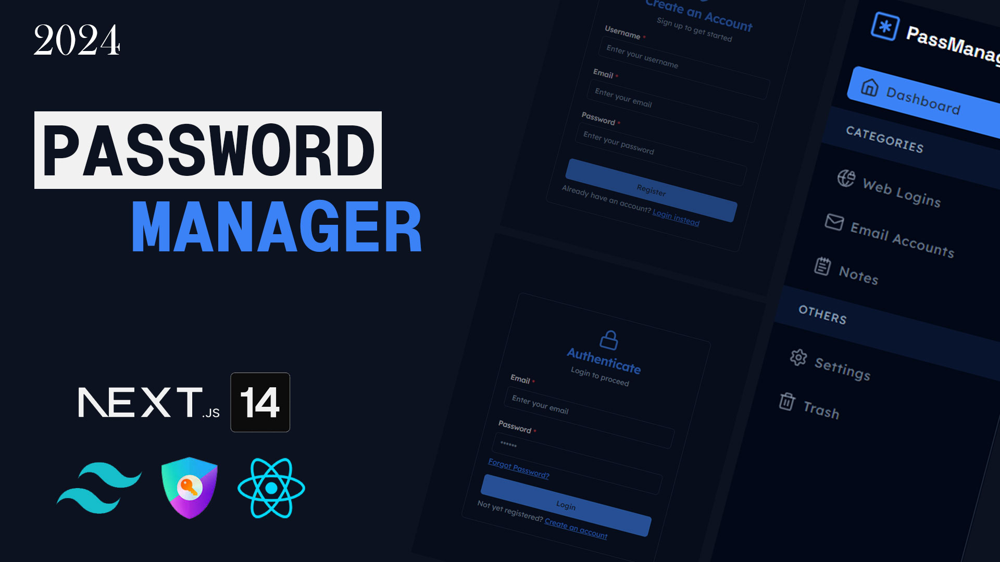

# Password Manager

Pass Manager is an open-source web app that simplifies password and note management, offering a secure and user-friendly experience. Built with Next.js 14.



## Table of Contents

- [Features](#features)

- [Used Technologies](#used-technologies)

- [Run Locally](#run-locally)

- [Contribution](#contribution)

## Features

- Access your encrypted password file through the user authentication page. Safeguard your passwords with an additional layer of security using user credentials.

- Seamlessly add, edit, and delete passwords within the app.

- Organize your passwords into different types for convenient categorization.

- Create notes for personal reference that you can access anytime

- Utilize pre-designed forms tailored for various password types, ensuring easy and consistent data entry.

- Store your passwords in an encrypted format in the database, ensuring the safety of your sensitive information. Utilize encryption powered by CryptoJS to maintain the confidentiality of your stored data.

- Enjoy a modern and user-friendly interface designed for efficiency and ease of use. Access various password types and features with a clean and organized layout.

- Dark/System mode integration

- Global Search integration

## Used Technologies

- `Next.js`: Harness the power of Next.js, leveraging its static site generation (SSG) capabilities to create a user interface.

- `shadcn/ui`: Enhance your app's visual and interactive elements with components from shadcn/ui. These beautifully designed components can be seamlessly integrated into your application, offering accessibility, customizability, and open-source goodness.

- `CryptoJS`: Utilize CryptoJS for strong encryption, ensuring that sensitive information such as passwords is securely stored within the app's encrypted local file.

- `Lucide React`: Enhance the visual appeal of your app with icons from Lucide React, adding a touch of aesthetic sophistication to the user interface.

- `Tailwind CSS`: Employ Tailwind CSS for efficient styling, enabling rapid development through its utility-first approach and streamlined design workflow.

- `Next-Auth`: Open-source authentication solution for Next.js applications.

- `Tiptap`: Create exactly the rich text editor you want out of customizable building blocks. Tiptap comes with sensible defaults, a lot of extensions and a friendly API to customize every aspect.

- `React Hook Form`: Intuitive, feature-complete API providing a seamless experience to developers when building forms.

## Run Locally

To get a copy of Passwords up and running on your local machine, follow these steps:

1. **Clone the repository**:

   ```bash
   git clone https://github.com/devbertskie/password-manager.git
   ```

   After successful cloned. Head over to the project directory

   ```bash
   cd password-manager
   ```

2. **Install Dependencies**:

   Navigate into the project directory and install the required dependencies:

   ```bash
   npm install
   ```

3. **Edit Environment Variables**:

   Rename `.env.example` to `.env` file:

   ```bash
   mv .env.example .env
   ```

   `Important`: Make sure to fill up the required environment variables before running the application to avoid unwanted errors.

4. **Run the Development Server**:

   Start the app in development mode with the following command:

   ```bash
   npm run dev
   ```

   Head over to your browser and access the `localhost:3000`

5. **Build the App**:

   To build the app, run the following command:

   ```bash
   npm run build
   ```

## Contribution

Contributions to Password Manager are welcomed and encouraged! If you're interested in improving the app, adding new features, fixing bugs, or enhancing documentation, your contributions are highly valued.
